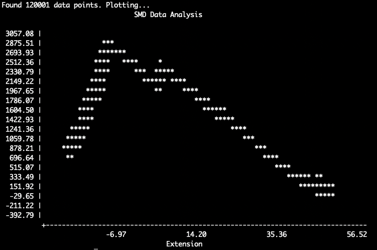

# SMD Plotter

A simple C++ terminal-based plotter for extracting and visualizing Steered Molecular Dynamics **Force vs Extension** profile from NAMD output files.

## Features

- Extracts the 5th (Z coordinates) and 8th (Force) fields from lines starting with "SMD" in NAMD output files.
- Subtracts the Z coordinates from the first step (to get the Extension).
- Plots the extracted data directly in the terminal
- No external dependencies required :)



## Known bugs
- Graphs aren't starting from Zero as expected.
  - I'm still figuring out what's going wrong with my calculations... 

## Building

```bash
mkdir build && cd build
cmake ..
make
